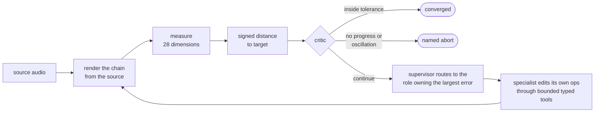

# headroom

[](https://github.com/KianSalem/headroom/actions/workflows/ci.yml)
[](LICENSE)
[](pyproject.toml)
[](pyproject.toml)
[](#why-the-numbers-are-trustworthy)

**An agent that masters audio, graded by a meter instead of by another LLM.**

Mastering is the last pass on a mix: loudness, tonal balance, stereo width and
dynamics brought to a delivery target. headroom closes that loop. It measures 28
dimensions of the audio, routes the largest error to the one of four bounded
specialists (EQ, dynamics, stereo, loudness) that owns it, applies the edit,
re-renders from the source, re-measures, and stops when the audio lands inside
tolerance or a critic says why it cannot. **The model never touches a sample.**
Every decision is scored against physics: integrated LUFS, true peak, spectral
balance, stereo correlation, crest factor. An import contract, not discipline,
keeps any LLM judge out of the metric.

The deliverable is the comparison. Seven controllers run the identical loop on
six MUSDB18 tracks × nine degradations, paired and Wilcoxon-tested. The
architecture with arithmetic in the model's seat beats a tuned proportional
controller (**p = 0.002**) in a median of **2 renders**, and costs $0. Put
Haiku 4.5 in the same seat and it is the only thing that can turn *"more
space, but keep the low end mono"* into constraints (94% of briefs), and the
worst of the three at sitting still.
Everything in this repository cost about $3.35 in API calls, and every call is a
committed cassette, so all of it replays with no key.


<details>
<summary>the same run as text</summary>

```
$ headroom master audio/synthetic/synth_01.wav mastered.wav --target club
target 'club' (loudness preset: loud club/CD master): 2 features across ['loudness']
system agent-scaffold

*  0  4.3904  1 out  gain.gain_db +4.234        role=loudness | targeting lufs_integrated -8.47 tol | 1 edit(s): gain.gain_db +4
*  1  0.0000  0 out  limiter.ceiling -0.300     role=loudness | targeting true_peak_dbtp +7.21 tol | 1 edit(s): limiter.ceiling
   2  0.0000  0 out  converged                  inside tolerance

distance 5.2811 -> 0.0000  recovery +1.000  converged
2 renders, 5.6s

source -> gain[gain_db=+4.23] -> limiter[ceiling_dbtp=-0.30 release_ms=50.00] -> render
wrote mastered.wav
```

</details>

Every recording on this page is generated, not captured: a committed
[vhs](https://github.com/charmbracelet/vhs) tape in [`docs/tapes/`](docs/tapes)
runs the real CLI against the synthetic corpus with `ANTHROPIC_API_KEY` empty,
so `vhs docs/tapes/master.tape` reproduces the frames and the recordings cannot
drift from the behaviour they show. An `.mp4` sits beside each `.gif`.

## Run it in 60 seconds

```sh
git clone https://github.com/KianSalem/headroom && cd headroom
pip install -e .                                    # Python 3.12+; no API key needed
headroom synth-corpus --out audio/synthetic         # a deterministic corpus, no download
headroom master audio/synthetic/synth_01.wav out.wav --target club
```

That is what CI runs on a clean checkout, on Linux and macOS, with the key
explicitly empty. `--system agent --model claude-haiku-4-5` swaps the
model-backed specialists in behind the same interface (`pip install -e .[agent]`
and a key). `--brief "..."` replaces the preset with a sentence.

## Results

Real music: six MUSDB18 test tracks, nine degradation kinds, 54 paired cells,
one seed, a 14-render budget for every system, `claude-haiku-4-5` for the agent,
20 s clips. **recovery** is the fraction of the degradation's distance to target
that was removed; 1.000 is a complete repair, 0 is no progress.

| system | recovery (median) | IQR | converged | oscillated | renders | cost |
|---|---|---|---|---|---|---|
| **`agent-scaffold`** (the architecture, arithmetic where the model goes) | **+0.991** | +0.912 to +1.000 | **67%** | **7%** | **2** | **$0** |
| `heuristic` (proportional controller, one edit per render) | +0.951 | +0.858 to +0.994 | 67% | 11% | 3 | $0 |
| `hillclimb` / `random` / `null` (floors) | ≤ +0.001 | | 0% | | | $0 |

Scaffold against heuristic, paired: 29 wins, 14 losses, 11 ties, **p = 0.002**.

The `agent` row is missing from that table on purpose. v1.1 corrected four
defects in the metric and the controllers, so every arithmetic system above
was re-run against the corrected measurement; the model-backed row could not
be, because a cassette records the prompt and the prompt carries the measured
numbers. Its v1 figures — +0.934 median, 54% converged, 31% oscillated, $1.20
— describe the old metric and are archived in
[`results/traces-v1-superseded/`](results/traces-v1-superseded) rather than
mixed into a table they are no longer commensurable with. Re-recording it is
the one outstanding item in [SCOPE.md](SCOPE.md) that costs money rather than
compute.

The comparison was run in four conditions, two corpora × two clip lengths, 54
cells each, to check that the architecture's advantage is about the material
and not about the sample size or the analysis window:

| corpus | clips | `agent-scaffold` | `heuristic` | gap | p |
|---|---|---|---|---|---|
| synthetic | 6.8 s | +1.000 | +0.993 | 0.007 | 0.109 |
| synthetic | 20 s | +1.000 | +0.994 | 0.006 | **0.045** |
| real music | 6.8 s | +0.997 | +0.951 | **0.046** | **0.010** |
| **real music** | **20 s** | **+0.991** | **+0.951** | **0.040** | **0.002** |

The gap is roughly seven times larger on real music at both clip lengths;
that, rather than significance, is what real music adds. The same controls cut down three
claims earlier versions of this page made, including "the model is significantly
worse", which held at 6.8 s and not at 20 s. The model's real weakness is
stability: change only the analysis window and its per-kind results move 18×
further than the scaffold's. Those two findings are v1-metric measurements and
stand until the model rows are re-recorded. The optimizer ceiling is also
v1-metric and was measured at 6.8 s rather than at the 20 s the headline uses,
so it is reported as a 6.8 s result that has not been shown to transfer. All
of it, with the bound, the retractions and the caveats, is in
[**docs/ANALYSIS.md**](docs/ANALYSIS.md); the generated tables are in
[`results/`](results/README.md).

## How it works



| role | owns (scored dimensions) | may touch |
|---|---|---|
| EQ | 10 spectral | `eq` |
| dynamics | 5 | `compressor`, `expander` |
| stereo | 11 | `stereo_width` |
| loudness | 2 | `gain`, `limiter` |

Six decisions carry most of the weight, and each exists because the obvious
alternative broke something measurable:

- **Processing is a declarative chain re-applied to the original source every
  render.** Nothing accumulates: a 240 Hz cut is *revised* from −3 dB to −1.5 dB
  rather than having a boost stacked on top, and the chain is the artifact you
  inspect, diff and export.
- **Every scored dimension has exactly one owner, and so does every op kind.**
  Asserted by tests. An unowned dimension is unfixable; a twice-owned one is
  two specialists correcting each other across turns.
- **A specialist sees only the dimensions it owns.** A filter over loop state,
  not an instruction, and asserted against the rendered prompt text.
- **Ownership is enforced by omission.** A specialist is never handed another
  role's tools. A call to one returns a structured refusal naming the owner,
  and the attempt is counted, so a prompt that leaks the boundary shows up as a
  number.
- **The budget is denominated in renders, not model calls.** Thinking longer
  buys no extra attempts on the audio, and a refused tool call costs a round
  trip, not a render.
- **A specialist may bundle several coordinated edits into one render.** The
  heuristic corrects one feature per render by construction. This is the
  architecture's entire numeric claim, so `edits/turn` is a reported number
  (4.64 on the stereo role) rather than a design intention.

Routing is arithmetic and gets no model call. What the supervisor does own is
harder and still deterministic: rerouting around a role that has missed twice,
accepting *"nothing I own can move this"* as a real answer, refusing to spend a
render on a chain that is audibly unchanged, and correcting op order back to
canonical mastering order, with the correction rate recorded.

Distance is measured before anything is decided, and chain order is enforced
rather than trusted. Hand it a chain with the limiter first and it says what it
moved:


<details>
<summary>the same two runs as text</summary>

```
$ headroom compare audio/synthetic/synth_01.wav --preset club
target 'club' (loudness preset: loud club/CD master): 2 features across ['loudness']
score 5.2811 (l2)  1/2 out of tolerance  converged=False
by family: loudness=27.890
lufs_integrated      -13.234 ==    -9.000 LUFS      delta  -4.234   -8.47 tol  TOO LOW
true_peak_dbtp        -3.093 <=    -0.300 dBTP      delta  -2.793  -13.96 tol  ->

$ headroom render audio/synthetic/synth_02.wav docs/media/out-of-order-chain.json ordered.wav
repositioned gain 885431a3: 2 -> 0
repositioned stereo_width 7c0d51e2: 3 -> 2
repositioned limiter b975822f: 0 -> 3
source -> gain[gain_db=+2.00] -> eq[peak 240Hz -3.0dB Q1.40, high_shelf 8000Hz +2.5dB Q0.71] -> stereo_width[width=1.30 band=7] -> limiter[ceiling_dbtp=-1.00 release_ms=50.00] -> render
wrote ordered.wav
```

True peak in a delivery preset is a **ceiling**, not a setpoint: 3 dB of
headroom is not an error, so the arrow points one way. The chain fed to the
second command is committed at
[`docs/media/out-of-order-chain.json`](docs/media/out-of-order-chain.json) with
the limiter at index 0, so the repositioning is real rather than staged.

</details>

## Where the model wins

Say what you want in words. The model's only job is to turn the sentence into
constraints; the same deterministic controller and metric do the rest.


<details>
<summary>the same run as text</summary>

```
$ headroom master audio/synthetic/synth_02.wav mastered.wav \
    --brief "More space and width, but keep the low end tight and mono."

brief: 'More space and width, but keep the low end tight and mono.'
  correlation_z       -2.0 tol ( -0.20 fisher-z)  -- more space
  width_5             +2.0 tol ( +2.00 dB)        -- more width
  width_6             +2.0 tol ( +2.00 dB)        -- more width
  width_7             +2.0 tol ( +2.00 dB)        -- more width
  width_8             +2.0 tol ( +2.00 dB)        -- more width
  hold at current value: width_0, width_1, width_2, width_3, width_4,
                         mono_compat_db, band_clr_0, band_clr_1, band_clr_2, band_clr_3
  translation cost 3326 in / 399 out

target 'brief:...': 15 features across ['spectral', 'stereo']

*  0  0.4724   3 out  width.band8 +0.202   role=stereo | 5 edits | targeting width_6 -2.00 tol
*  1  0.3114  10 out  width.global -0.166  role=stereo | targeting mono_compat_db -2.96 tol
   ...
distance 0.5330 -> 0.3114  recovery +0.416  stopped: no_improvement

source -> stereo_width[1.20 band=5] -> stereo_width[1.20 band=6] -> stereo_width[1.20 band=7]
       -> stereo_width[1.20 band=8] -> stereo_width[0.89] -> render
```

</details>

The half of that brief which says *don't* becomes ten held dimensions rather
than a hope. It does not converge: holding mono compatibility genuinely fights
widening the top, the metric encodes that trade-off, and the system reports a
compromise at +0.416 instead of pretending.

Briefs are graded with no LLM judge. Each carries the regions it must move and
the direction, written down in advance; the scores are arithmetic. Same recorded
translations, two controllers:

| controller | translation | execution | collateral | all three | controller cost |
|---|---|---|---|---|---|
| **`agent-scaffold`** | 94% | **75%** | **88%** | **4/8** | **$0** |
| `agent` | 94% | 56% | 85% | 2/8 | $0.11 |

The design conclusion is a split, and it is measured rather than asserted: the
model reads intent at 94%, and arithmetic closes the loop better than the model
does, for free. Detail in [`results/BRIEFS.md`](results/BRIEFS.md). Both rows
are v1-metric: the brief translations are recorded cassettes, so this table
waits on the same re-record as the `agent` row above.

Translation is the half least likely to move when it is re-run. It is scored
on which regions a sentence names and in which direction, and neither of the
two corrected features is one a brief asks for by name.

## What is built here, and what is used

| built in this repository | used |
|---|---|
| the 28-dimension analyzer, every feature validated against a signal with an analytically known value | `pyloudnorm` for K-weighted, gated LUFS |
| the true-peak meter: within 0.006 dB of analytic ground truth, agrees with `ffmpeg ebur128` | `librosa` for onsets and harmonic/percussive separation |
| an oversampled true-peak limiter, a downward expander, band-limited stereo width, none of which `pedalboard` has | `pedalboard` for EQ, compressor and gain |
| the tolerance-scaled, signed, per-family-weighted distance metric | `scipy` for Welch spectra, filter design and Powell |
| supervisor, critic, typed bounded tool layer, briefing filter, working memory | the Anthropic SDK, reachable from exactly one module |
| record/replay cassettes with usage-priced cost accounting | `pydantic` for every schema and trace |
| degradations, eval runner, paired statistics, the HTML listening page | `vhs` for the recordings above |

## Why the numbers are trustworthy

Every API call is recorded to a cassette committed in
[`cassettes/`](cassettes/), so the agent row reproduces at zero cost and with no
key. That is verified rather than claimed:

```
$ headroom fetch-corpus --archive musdb18 --tracks 6      # the audio is fetched, never vendored
$ ANTHROPIC_API_KEY="" HEADROOM_CASSETTE_MODE=replay \
    headroom eval --manifest results/corpus_manifest_musdb18.json --systems agent \
    --seeds 1 --clip-seconds 20 --out /tmp/replay --check-against results/traces-musdb18-20s
...
54 traces, 0 cells skipped
54/54 model-backed cells fully replayed from cassettes; actual spend $0.0000 (recorded cost $1.2043)
recovery mismatches against results/traces-musdb18-20s: 0 of 54 matched traces
```

The last line is an exit code, not a sentence: any cell that lands on a
different recovery than the published trace fails the command.

**That command does not run today, and the reason is the mechanism working.**
A cassette is keyed on the request, the request carries the measured numbers,
and v1.1 changed two of the measurements — so every model-backed key is a
miss until the row is re-recorded, and replay mode turns a miss into a
non-zero exit rather than a quiet zero-recovery row. The recordings and the
v1 traces are kept at
[`results/traces-v1-superseded/`](results/traces-v1-superseded); what they
reproduce is the v1 metric. Cassette replay itself is unaffected and still
asserted on every push: `test_every_committed_cassette_replays` plays each
committed recording back against its own request.

The cassettes are the API traffic verbatim, which makes the directory a readable
record of every prompt the system has ever sent. A test asserts across every
committed cassette that none carries a credential, that each one's key matches
its own request, and that the recorded tool calls still apply to a chain today.
In replay mode a missing recording ends the evaluation with a non-zero exit
rather than becoming a zero-recovery row, so "the prompt changed and nobody
re-recorded" is a failure, not a quiet bill or a quiet number.

```
$ lint-imports
Deterministic core imports nothing from anthropic    KEPT
Only agent.client may reach the model                KEPT
Core layers point one way                            KEPT
```

The second contract is the one that matters most. Exactly one module in the
repository can reach the API, so routing, the tool layer, the briefing filter and
the working memory, the parts the evaluation makes claims about, are tested on
every fork's pull request with the key explicitly empty. CI runs the whole suite
that way on Linux and macOS against a locked dependency set, then runs the demo
above on a clean checkout. `mypy --strict` and `ruff` are clean across the tree.
Bounds live in one set of annotations and are read from there by both the
validators and the JSON schemas the model sees, so the advertised range and the
enforced range cannot drift apart.

Five of the six systems in the table are arithmetic and `headroom eval` defaults
to exactly those, so a fresh clone gets a full results table with no credential.
The real corpus is public and fetched by one command that pins it to the digest
Zenodo publishes; MUSDB18 is non-commercial with per-track terms, so this
repository ships the manifest and the digest, never the audio, and
`headroom report --html` refuses to write audio for any corpus whose manifest is
not marked redistributable.

## Commands

```
pip install -e .                                  # add [agent] for the model-backed system

headroom master mix.wav out.wav --target spotify                       # deliver to a platform
headroom master mix.wav out.wav --reference ref.wav --target spotify   # match a record, at platform level
headroom master mix.wav out.wav --brief "warmer, but keep the punch"   # say it in words
headroom master mix.wav out.wav --target club --system agent --model claude-haiku-4-5

headroom analyze mix.wav                          # the full feature vector
headroom compare mix.wav --preset spotify         # signed, per-feature distance to a target
headroom compare mix.wav --reference ref.wav      # ...or to a reference track's profile
headroom render mix.wav chain.json out.wav        # apply a declarative chain
headroom presets                                  # delivery targets

headroom synth-corpus --out audio/synthetic       # a corpus with no download
headroom fetch-corpus --archive musdb18 --tracks 6 # real music: 4.7 GB in, ~60 MB kept, md5-pinned
headroom fetch-corpus --archive musdb18-7s        # the 147 MB 7 s excerpts, for a quick look
headroom corpus audio/mine --redistributable      # a train/test manifest for your own audio
headroom corpus-stats                             # what the corpus is actually like
headroom eval                                     # the matrix; free systems by default
headroom report --html results/report             # tables plus a listening page
headroom brief-eval audio/synthetic/synth_02.wav  # score brief translation, no LLM judge
```

`fetch-corpus` exists because the honest headline needs real music and the
standard corpus, MUSDB18-HQ, is a 22.66 GB download. It pulls the same tracks
from a smaller distribution, verifies the archive against the MD5 Zenodo
publishes, decodes only the mixture stream out of each five-stream file, and
deletes the archive afterwards. Peak disk is the archive plus one track.

## Coming soon

**A DAW plugin.** Everything on this page is a terminal, and that is the part
the loop cares about least: processing is a declarative chain, and the chain is
already the artifact the system builds, revises, diffs and exports. The plugin
puts that where the mix already lives — the target, the 28 measured dimensions
and the signed distance to each, and the chain the loop wrote, in the session,
in front of the audio it was written for.

Nothing in this section is built yet. Everything above it is.

## Reading the code

| path | what is in it |
|---|---|
| `src/headroom/analysis/` | the 28-dimension feature vector, validated analytically |
| `src/headroom/dsp/` | typed bounded ops, the declarative chain, deterministic render, the hand-written primitives |
| `src/headroom/target/` | the tolerance-scaled distance metric and target profiles |
| `src/headroom/control/` | the shared loop and the deterministic critic |
| `src/headroom/baselines/` | heuristic, optimizer bound, random and hillclimb floors |
| `src/headroom/agent/` | roles, tools, briefing, memory, supervisor, cassettes, the one model boundary |
| `evals/` | corpus fetch and split, degradations, runner, statistics, HTML report |
| `docs/tapes/` | the tape scripts that record the demos on this page |

`src/headroom/agent/__init__.py` names the reading order for the agent package.

- [**docs/ANALYSIS.md**](docs/ANALYSIS.md): the full results argument, the bound, the retractions, the caveats.
- [**SCOPE.md**](SCOPE.md): what v1 ships, what is deferred, every deviation from the spec, and the known issues.
- [**SPEC.md**](SPEC.md): the original design.

Source code is MIT. No audio is distributed under that licence: the evaluation
corpus is fetched from Zenodo under its own terms and never committed, and the
synthetic clips under `results/report/` are generated by this code.
